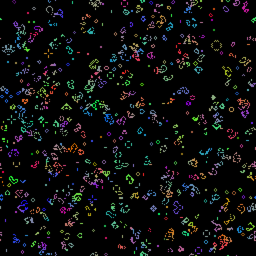

# kivy-playground

Playing around with [Kivy](https://github.com/kivy/kivy).

## life

Conway's game of life using shaders.

Configure values in `main.py`

```python
WINDOW_SIZE = 512, 512
FBO_SIZE = 256, 256
FPS = 20
```

There's also two shader variants we can switch
between.

* `life.glsl`: Simple white cells
* `life_colors.glsl`: Colored cells



## Related Links

https://github.com/salt-die/Snippets/blob/master/game_of_life_averages.py
